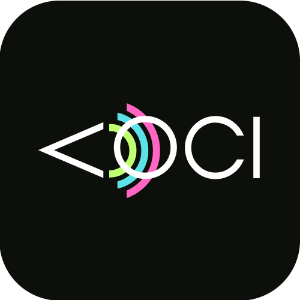

<!-- Improved compatibility of back to top link: See: https://github.com/othneildrew/Best-README-Template/pull/73 -->

<a name="readme-top"></a>

<!-- PROJECT LOGO -->
<br />
<div align="center">
  <a href="https://github.com/angiejo21/VOCI">
    
  </a>

<h3 align="center">VOCI | Typescript </h3>

  <p align="center">
    A platform for gender equality 
  </p>

[![MIT License][license-shield]][license-url]
[![LinkedIn][linkedin-shield]][linkedin-url]

</div>

<details>
  <summary>Index</summary>
  <ol>
    <li>
      <a href="#about-the-project">About The Project</a>
      <ul>
        <li><a href="#the-assignment">The assignment</a></li>
        <li><a href="#features">Requirements</a></li>
      </ul>
    </li>
    <li>
      <a href="#getting-started">Getting started</a>
      <ul>
        <li><a href="#requirements">Requirements</a></li>
        <li><a href="#structure">Structure</a></li>
        <li><a href="#installation">Installation</a></li>
      </ul>
    </li>
    <li><a href="#license">License</a></li>
    <li><a href="#contact">Contact</a></li>
  </ol>
</details>

<!-- ABOUT THE PROJECT -->

## About The Project

VOCI is the final project for [start2impact](https://www.start2impact.it/)'s module "Typescript" in the Full-stack developer course.

### The assignment:

Develop a TypeScript system designed for an online media company that promotes gender equality by facilitating interaction between media professionals and platforms and by providing training courses and mentorships.

### Features:

- The project requires no frontend, but must implement the interfaces _IMediaProfessional_, _ITrainingProgram_, and _IPlatform_ .
- A professional can enroll or be enrolled in a training program/course/mentorship.
- A media platform can publish content created by a professional.

#### I created a working sample of the code on CodePen, you can check the implementation opening the console with F12: [VOCI CodePen](https://codepen.io/angiejo21/pen/ZENgNyP).

<p align="right">(<a href="#readme-top">back to top</a>)</p>

## Getting started

### Requirements

- Node
- Typescript

### Structure

```sh
└── VOCI/
    ├── package-lock.json
    ├── package.json
    ├── src
    │   ├── class.ts     // implements classes
    │   ├── index.ts     // sample usage
    │   └── interface.ts // definition of types and interfaces
    └── tsconfig.json    // compiler configuration

```

### Installation

1. Clone the VOCI repository:

```sh
git clone https://github.com/angiejo21/VOCI
```

2. Change to the project directory:

```sh
cd VOCI
```

3. Install the dependencies:

```sh
npm install
```

4. Compile the TypeScript code:

```sh
npm build
```

5. Run the code:

```sh
npm start
```

<p align="right">(<a href="#readme-top">back to top</a>)</p>

<!-- LICENSE -->

## License

Distributed under the MIT License. See `LICENSE.txt` for more information.

<p align="right">(<a href="#readme-top">back to top</a>)</p>

<!-- CONTACT -->

## Contact

Angela Bellò - [Portfolio](https://bello.codes)

Project Link: [https://github.com/angiejo21/VOCI](https://github.com/angiejo21/VOCI)

<p align="right">(<a href="#readme-top">back to top</a>)</p>

<!-- MARKDOWN LINKS & IMAGES -->
<!-- https://www.markdownguide.org/basic-syntax/#reference-style-links -->

[license-shield]: https://img.shields.io/github/license/angiejo21/VOCI.svg?style=for-the-badge
[license-url]: https://github.com/angiejo21/VOCI/blob/master/LICENSE
[linkedin-shield]: https://img.shields.io/badge/-LinkedIn-black.svg?style=for-the-badge&logo=linkedin&colorB=555
[linkedin-url]: https://www.linkedin.com/in/angelabello/
